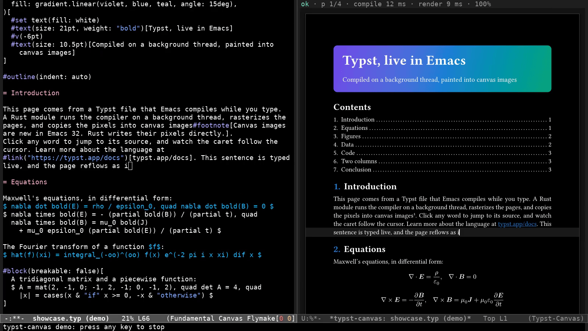
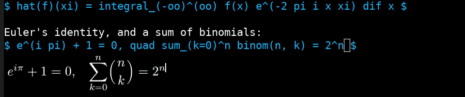
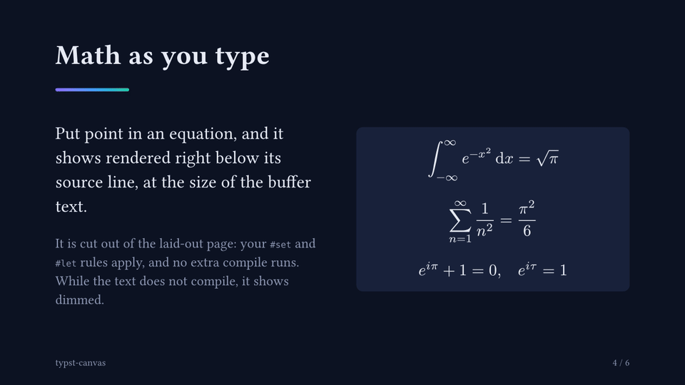

# typst-canvas

Live Typst preview inside Emacs 32. A Rust module compiles the buffer on a background thread and
paints the pages into canvas images, about 25 ms after each key. No external process, no PDF
viewer, no browser. The equation at point shows rendered below its source line, and the pages can
be presented as slides.



`M-x typst-canvas-demo` types into the showcase document by itself. `bin/screencast.sh` records it
as `target/screencast.mp4` and `target/screencast.gif`, and `bin/screencast.sh inline-math` records
an equation as it is typed (`target/inline-math.gif`).



## Requirements

- Emacs 32 (development) built with a window system and Cairo, e.g. the GTK build. The preview needs a graphical frame.
- Rust 1.92 or later. The first build compiles Typst, which takes a few minutes.
- A checkout of [emacs-module-rs](https://github.com/ubolonton/emacs-module-rs) at `../../emacs-module-rs`, for its unreleased canvas binding (`emacs-32-experimental`).
- For the scripts in `bin/`: `jq`. Under Xvfb: `xvfb-run`; for the screencast also `ffmpeg`.

## Quick start

``` bash
EMACS=emacs-32-gtk bin/test.sh  # Builds the module, links it as typst-canvas-dyn.so, runs the tests.
```

``` emacs-lisp
(add-to-list 'load-path "/path/to/typst-canvas")               ; typst-canvas.el
(add-to-list 'load-path "/path/to/typst-canvas/target/debug")  ; typst-canvas-dyn.so
(require 'typst-canvas)
```

Then turn on `typst-canvas-mode` in a Typst buffer, or run `M-x typst-canvas-demo`. Press any key
to stop the demo. To present the pages, run `M-x typst-canvas-present`, e.g. in
`examples/slides.typ`.

## Keys

In the preview buffer:

| Key | Action |
|-----|--------|
| `+` or `=`, `-`, `0` | Zoom in, zoom out, fit the page width to the window |
| `n`, `p` | Next page, previous page |
| `<left>`, `<right>` | Scroll a zoomed page horizontally (also `C-x <`, `C-x >`, shift + wheel) |
| `mouse-1`, `RET` | Jump to the source of the clicked text (`RET`: the middle of the visible part of the page) |
| `t` | Toggle theme colors in this preview |
| `g` | Compile again |
| `q` | Quit the window |

In a presentation (`M-x typst-canvas-present`):

| Key | Action |
|-----|--------|
| `SPC`, `n`, `<right>`, `<down>`, `<next>` | Next slide |
| `DEL`, `p`, `<left>`, `<up>`, `<prior>` | Previous slide (`DEL` first deletes typed digits) |
| digits, then `RET` | Go to that slide, e.g. `3 RET` |
| `<home>`, `<end>` | First slide, last slide |
| `q` | Quit |



## Options

| Option | Default | Effect |
|--------|---------|--------|
| `typst-canvas-follow-cursor` | `t` | Show the source cursor as a caret on the page, and keep it in view |
| `typst-canvas-inline-math` | `t` | Show the equation at point rendered below its source line |
| `typst-canvas-inline-math-scale` | `1.25` | Size of that equation, relative to the buffer text |
| `typst-canvas-present-frame` | `t` | Present in a new fullscreen frame; `nil`: in the selected window |
| `typst-canvas-match-theme` | `t` | Page and text colors from the `default` face |
| `typst-canvas-enable-flymake` | `t` | Turn on `flymake-mode` for compile errors and warnings |
| `typst-canvas-display-action` | right, half width | `display-buffer` action for the preview |
| `typst-canvas-zoom-step` | `1.25` | Factor of each zoom step |
| `typst-canvas-zoom-range` | `(0.25 . 4.0)` | Smallest and largest zoom |
| `typst-canvas-desk-color` | `nil` | Color around the pages; `nil` derives it from the `default` background |
| `typst-canvas-default-width` | `800` | Preview width in pixels when no graphical window shows it |
| `typst-canvas-demo-speed` | `1.0` | Speed of `typst-canvas-demo` |

## How it works

- Each change sends the whole buffer text to a Rust thread. The thread works only on the newest text: it compiles it incrementally with the `typst` crate, and renders the changed pages with `typst-render`, in parallel.
- When a result is ready, the thread writes a byte to a pipe process. The process filter copies the changed pages into canvas images, one image per page, one page per line of the preview buffer.
- The caret is drawn onto a page when it is copied, so cached page images stay clean. A click maps back to the source with `typst_ide::jump_from_click`.
- Theme colors become Typst library styles, not edits of the source, so source positions stay valid.
- Errors go to Flymake. The preview keeps the last good pages.
- The equation at point is cut out of the last good layout (the frame items between its introspection tags), and rendered again at the buffer text size. So it keeps the document's `#set` and `#let` rules, and needs no extra compile. Slides are an extra image of the same compile, as large as fits the presentation window.

Details: [DESIGN.md](DESIGN.md).

## Latency

`bin/latency.sh` edits page 1 of `examples/showcase.typ` (4 A5 pages) in `emacs-32-gtk` under
Xvfb (1600x900, preview 800 px wide, 6-vCPU VM). It measures from the buffer change to the end of
the redisplay that shows it. Median of 20 edits, in ms:

| Edit | Total | Compile | Render | Lisp | Redisplay |
|------|------:|--------:|-------:|-----:|----------:|
| One char | 22 | 1.3 | 7.4 | 5.1 | 5.3 |
| A paragraph that moves all later pages | 30 | 1.3 | 15.6 | 6.2 | 4.7 |

The rest of the total is the timer that sends the text and the notification. With this crate at
`opt-level` 0, the same edits took 148 and 551 ms: the per-pixel loops need optimizations, so the
dev profile uses `opt-level` 2.

## Development

``` bash
cargo test                            # Rust unit tests
EMACS=emacs-32-gtk bin/test.sh        # ERT tests, in batch mode
EMACS=emacs-32-gtk bin/latency.sh     # The latency table above
EMACS=emacs-32-gtk bin/screenshot.sh  # target/screenshot-{1..9}.png
EMACS=emacs-32-gtk bin/screencast.sh  # target/screencast.mp4 and .gif
EMACS=emacs-32-gtk bin/screencast.sh inline-math  # target/inline-math.mp4 and .gif
```

## Limitations

- Needs Emacs 32, which is not released, and an unreleased emacs-module-rs feature.
- Only the buffer text is live. Included files come from disk, so unsaved changes in other buffers do not show.
- All pages are rendered, and each is kept twice (in Rust and in its canvas): about 3.5 MB per copy for an A5 page at 800 px. Long documents use much memory.
- An edit that moves later pages re-renders all of them.
- The caret shows only in laid-out text, not in code.
- A new equation shows below its line only after its first good compile. Until then, and while an error is in it, the last image of that equation shows dimmed.
- A presentation frame is fullscreen only if the window manager supports it. Without a window manager, as under Xvfb, Emacs sizes it itself.
- Theme matching changes only the default colors. Documents that set their own colors keep them, and other default strokes stay black.
- Tested only on Linux, with the GTK build.
